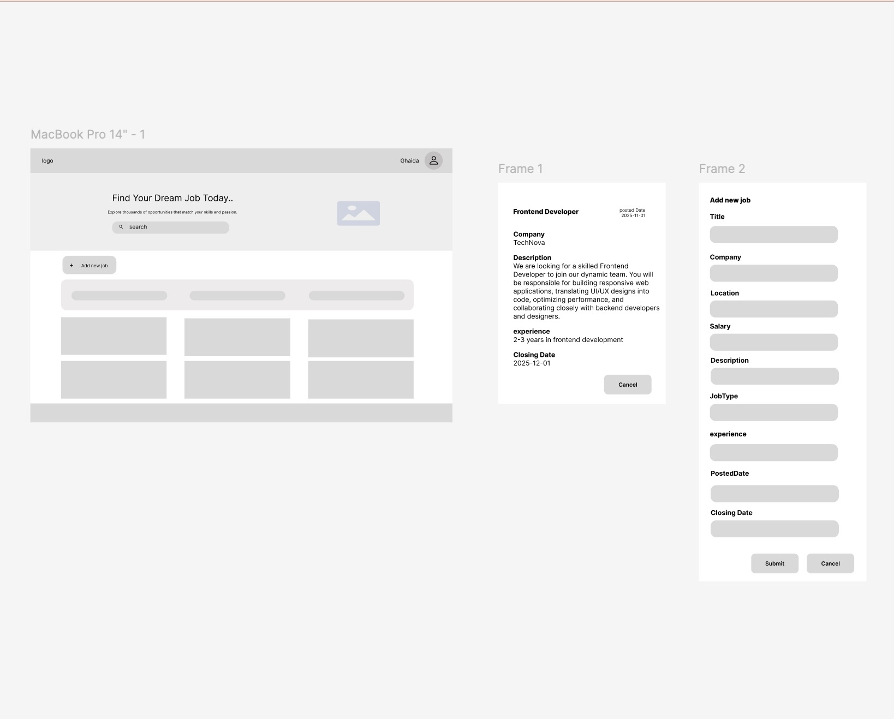
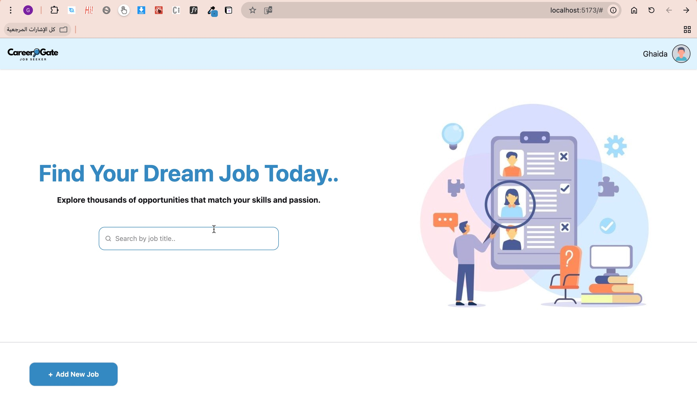

#  Mini Job Listing Web App

## Why This Project?

Job seekers often browse through dozens of opportunities daily, which can be confusing and time-consuming without proper tools to organize and filter results.
This project was built to simplify the job search experience for users at the fresh or junior level. The goal was to create a lightweight and intuitive web app where users can search, filter, and add job listings easily — all within a clean and responsive interface.

## Project Overview

The Mini Job Listing Web App is a front-end project built with React, designed to help users explore job opportunities efficiently.
The app displays a list of job postings including details like title, company, location, and salary, while allowing users to:

🔍 Search for jobs by title (case-insensitive)

🌍 Filter by location

💰 Filter by salary range (minimum and maximum)

📝 Add a new job dynamically (state only, no backend)

📄 View job details in a modal for a focused experience

All data is loaded from a mock JSON file (data/jobs.json), ensuring smooth state management using only React state (no backend or context required).
The design is fully responsive, ensuring a clean and modern look across both desktop and mobile devices.
## Tech Stack

Frontend: React, Tailwind CSS 

Libraries: react, tailwindcss
 
Other Tools: Git, GitHub, Visual Studio Code

# Installation Instructions
 

Clone the frontend repository:

- `git clone https://github.com/Ghaida-Aloufi/job-listing-app.git`

- `cd job-listing`

Install dependencies:

- `npm install`

Start the development server:

- `npm run dev`

## ireframes & Sketches

## Screenshots
## Dashboard Page

## What I Learned🚀

 Through this project, I gained hands-on experience with:

- Managing React state for search, filters, and form inputs

- Creating responsive layouts with Tailwind CSS

- Handling dynamic rendering of filtered data

- Organizing code using component-based structure

- Improving debugging and version control skills using Git & GitHub

## Future Improvements 🎯 

To enhance user experience and make the app more functional, I plan to:

- Add localStorage integration to save job listings persistently

- Implement sorting options (e.g., by salary or company name)

- Add pagination for better performance with large data sets

- Introduce a dark mode toggle

- Connect the app to a backend API for real job data